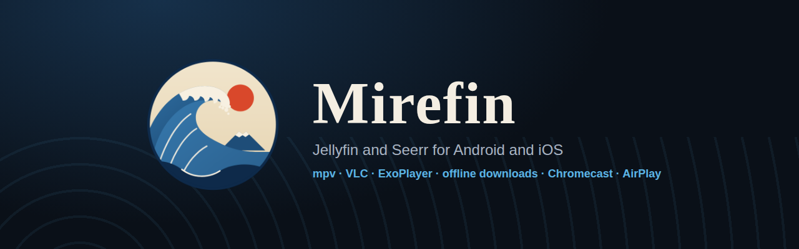
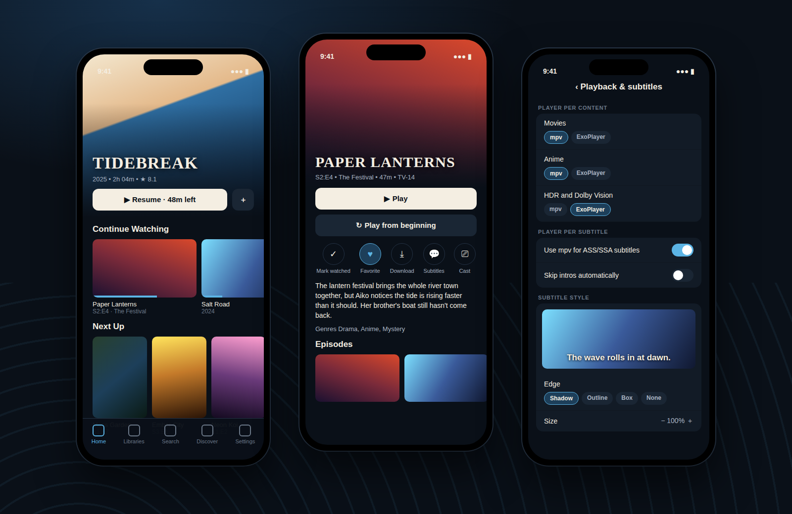
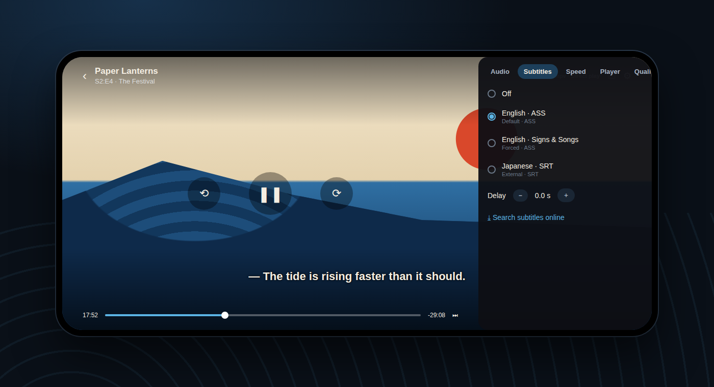

<p align="center"></p>

# Mirefin

A Jellyfin client for Android and iOS phones and tablets, with built-in [Seerr](https://github.com/seerr-team/seerr) (Jellyseerr / Overseerr) support for discovering and requesting new movies and shows. Playback runs on mpv (Android) or VLC (iOS), so nearly every codec and ASS/SSA subtitle plays as intended, with the system player taking over for HDR and Dolby Vision.

<p align="center"></p>
<p align="center"></p>

<sub>Previews are design renders of the app's screens with placeholder artwork, not captures from a device.</sub>

## Credits

- **[Wholphin](https://github.com/damontecres/Wholphin)**, the open-source Android TV client for Jellyfin by [damontecres](https://github.com/damontecres) and contributors, for the design this app brings to mobile: the backdrop hero, home rows, detail pages and Seerr integration, and the mpv-first / ExoPlayer-for-HDR playback approach. If you have an Android TV, go use Wholphin.
- **Moonfin** for ideas on playback and subtitle options.
- **[Jellyfin](https://jellyfin.org)** for the media server and API, **[Seerr](https://github.com/seerr-team/seerr)** for the request server and API. Discover metadata and images come from TMDB via Seerr.
- **[mpv](https://mpv.io)** (via libmpv) and **[VLC](https://www.videolan.org)** (via libVLC) for playback.

Mirefin is an independent project written from scratch in TypeScript and Kotlin. It is not affiliated with or endorsed by the Wholphin, Moonfin, Jellyfin or Seerr projects and contains none of their code or assets. The wave logo is original artwork in the style of Japanese woodblock prints.

## Features

**Library**
- Sign in to any Jellyfin server (HTTP or HTTPS, LAN or remote)
- Home page with a backdrop hero, Continue Watching, Next Up and Recently Added rows per library
- Library browsing with sort and filters, search across libraries
- Detail pages for movies, series, seasons and episodes, with season picker, episode list, cast and "More Like This"; mark watched and favorite

**Playback**
- Three engines: mpv (Android), VLC (iOS) and the system player (ExoPlayer / AVPlayer)
- Choose the engine per content type (movies, episodes, anime, other, HDR / Dolby Vision) and per subtitle type (switch to mpv/VLC for ASS/SSA, burn in or switch for PGS/VobSub)
- Direct play, direct stream or server transcode, with a maximum bitrate, audio channel limit and HEVC / AV1 toggles
- Player controls with audio, subtitle, speed, engine and quality menus
- Skip intro and credits (button or automatic, from Jellyfin media segments) and autoplay of the next episode
- Automatic fallback: if mpv/VLC can't open a stream the system player takes over, then a server transcode
- Resume position and progress reporting back to Jellyfin, picture-in-picture on the system player

**Subtitles**
- Jellyfin-style subtitle modes (Default, Smart, Always, Only forced, Off) with preferred audio and subtitle languages
- Style: size, color, edge (shadow, outline, box), bold, position and delay, with a live preview
- Search and download subtitles from your server's providers (for example the OpenSubtitles plugin)

**Offline and casting**
- Download movies and episodes in original quality or converted to a smaller MP4, with text subtitles saved alongside
- Chromecast from the detail page or mid-playback, AirPlay on iOS

**Seerr**
- Discover rows (trending, popular, upcoming), search, detail pages and requests (pick individual seasons). Sign in with your Jellyfin account, a local Seerr account or an API key
- Jump from a Seerr title that is already available straight to it in your library

## Tech stack

- [Expo](https://expo.dev) SDK 57 / React Native, TypeScript
- [Expo Router](https://docs.expo.dev/router/introduction/) for file-based navigation (`src/app`)
- libmpv through a local Expo module (`modules/mpv-player`) on Android, [react-native-vlc-media-player](https://github.com/razorRun/react-native-vlc-media-player) on iOS, and [expo-video](https://docs.expo.dev/versions/latest/sdk/video/) for the system player
- [react-native-google-cast](https://github.com/react-native-google-cast/react-native-google-cast) for Chromecast, [expo-file-system](https://docs.expo.dev/versions/latest/sdk/filesystem/) for downloads, [expo-image](https://docs.expo.dev/versions/latest/sdk/image/) for artwork
- [expo-secure-store](https://docs.expo.dev/versions/latest/sdk/securestore/) for tokens and credentials

```
src/
  api/          Jellyfin and Seerr clients, playback device profile
  app/          Screens (Expo Router)
    (tabs)/     Home, Libraries, Search, Discover, Settings
    item/       Jellyfin item detail
    library/    Library grid
    player/     Video player
    subtitles/  Online subtitle search
    seerr/      Seerr detail and request
  components/   Cards, rows, hero, shared UI, player engines and menu
  lib/          Session, settings, playback planning, downloads, casting, theme
modules/
  mpv-player/   libmpv video view for Android
```

## Getting started

```bash
npm install
npm start          # then press a for Android or i for iOS
```

The player uses native modules, so use a [development build](https://docs.expo.dev/develop/development-builds/introduction/) rather than Expo Go:

```bash
npx expo run:android
npx expo run:ios
```

Or build in the cloud with EAS:

```bash
npx eas-cli@latest build --platform android
npx eas-cli@latest build --platform ios
```

Type-check with `npm run typecheck`.

## Notes

- Android 8.0 (API 26) or newer is required, because libmpv needs it.
- Cleartext HTTP is allowed on both platforms so LAN servers like `http://192.168.1.10:8096` work.
- With mpv or VLC nearly every file direct-plays. On the system player, Android direct-plays MKV/WebM with H.264, HEVC, VP9 and AV1, and iOS direct-plays MP4/MOV with H.264 and HEVC; everything else is transcoded by the server.
- Casting uses the default media receiver, so the server converts to MP4 or HLS the Chromecast can play.

## Android APK

Every pull request and push to `main` builds a release APK (arm64) with GitHub Actions (`.github/workflows/android-apk.yml`). Open the latest **Android APK** run under the repository's Actions tab and download the `Mirefin-apk` artifact. It is signed with the default debug key, so it installs directly (allow installs from unknown sources) but is not suitable for the Play Store.
